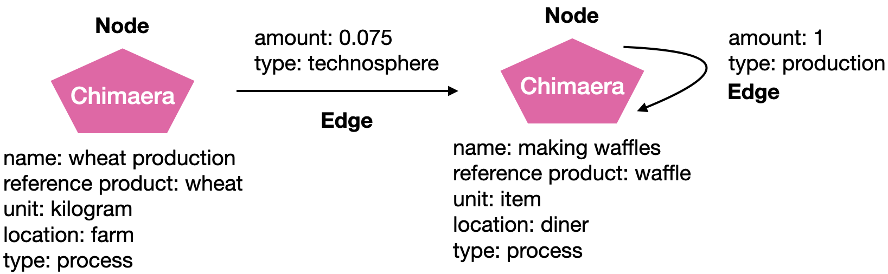

# Inventory construction

## Processes, products, and something in between

At its heart, Brightway uses a graph data schema with nodes and edges. We are eventually moving towards storing everything in the graph, including databases and LCIA data, but for now the graph just has inventory data.

There are at least two main ways to model inventory data as nodes and edges. The ideal way would be to have a clean separation between products (goods and services) and processes. This distinction translates directly to the technosphere matrix, whose *row* are *products* and whose *columns* are *processes*. Technosphere edges would then be flows of products into and out of (products, including wastes or co-products, being produced) processes. In this approach, products coming into processes are inputs being consumed by the process, but can also include wastes being treated by the process. Similarly, outputs of a process include useful product or products, but also wastes being produced.

It's important to bear in mind that both input and output edges can be functional. A functional edge is the purpose of modelling the process in the first place. Creating a process is a conscious decision, where a practitioner chooses that this process is a necessary and discrete part of a value chain, and is located in a particular spatial, temporal, and technological context.

Here is an example of what such a graph would look like and the corresponding Brightway objects:


It's interesting to think about the implications of this paradigm. Process separated from products do not have units, for example - they can have zero, one, or multiple functional edges, and only products have units. Processes do not have a "reference product", or at least not necessarily, so your code shouldn't assume this attribute is present. There also is no expectation of values being on the diagonal of the technosphere matrix, or any meaning to that diagonal - the ordering of processes and products is arbitrary and independent of one another. The only real constraint on processes and products is that the matrix produced from the entirety of the data is non-singular.

However, many databases we build on or import do not make a clean distinction between products and processes. In this case, to accurately reflect the data schema of the imported data, and to simplify graph traversal, we can create a chimaera node with is [both process and reference product](https://github.com/brightway-lca/bw_interface_schemas/blob/5fb1d40587aec2a4bb2248505550fc883a91c355/bw_interface_schemas/lci.py#L83), which can be referenced in both technosphere rows and columns. In these processes, the information of the (reference) product is given by:

* `unit`: The unit of the product produced
* `reference product`: The name of the product produced

Here is an example of what such this graph would look like:



The first approach is preferred in theory, the second approach is more widely used in practice.

Either approach works with biosphere flows - the can be linked to both separate processes and and chimaera process+product nodes. However, biosphere flows should not be linked to separate products, as it makes no methodological sense, and this information will be ignored in matrix construction.

## Technosphere edges: positive and negative values

You may have seen the following matrix equation for IO or LCA: $h = (I - A)^{-1}f$. Brightway does **not use this equation** - instead, we use the following: $h = A^{-1}f$. In other words, we do not assume that each column in our technosphere matrix (**A**) is normalized to one unit of production. This is an arbitrary restriction, and Brightway does not like arbitrary restrictions. So we choose to manually construct the technosphere matrix, and choose which numbers are positive and which are negative. The sign convention here is simple:

* Positive numbers in the technosphere are products (goods and services) being *produced* by a process. This can include waste.
* Negative numbers in the technosphere are products (goods and services) being *consumed* by a process. This can include waste.

Remember, in the technosphere matrix products are rows, processes are columns, but sometimes we have chimaera nodes which act as both products and processes.

The *sign* of an edge numeric value is not related to whether or not that edge is *functional*. Wastes can be produced (positive value), but producing waste is never the function of a process.

## What information enters the matrices?

Brightway uses a combination of the node and edge *types* to deteremine where to put edge data in the technosphere and biosphere matrices. These type filter values are configurable, and can be customized if needed.

The rules are relatively simple:

1. If an edge (exchange on a `Node` instance) has a type in `bw2data.labels.technosphere_positive_edge_types`, and the edge *output* `Node` has a type in `bw2data.labels.process_node_types`, then the numeric amount of the edge will be added to the *technosphere* matrix without modification, with a row index derived from the edge *input* and a column index derived from the edge *output*.

That was a mouthful! Let's break it down:

* We want to be able to put additional data in the database and not have it be used in matrix construction. For example, we could create a `Node` which gives data lineage, or revision history, or review comments, or links to external models. These nodes would have a `type` value like "ignore me please", and this *process node type* is not in `bw2data.labels.process_node_types` (which defaults to "process" and an empty type value), so this node and its edges would not be used in matrix construction.
* Every section in `bw2data.labels` is a list, and can be appended to or even replaced completely, if you want to use different labels.
* We will put both positive numbers and negative numbers into the technosphere matrix, and the meaning of positive and negative values is given above. If the edge type is in `bw2data.labels.technosphere_positive_edge_types` (which defaults to "production" and "substitution"), then we know the numeric value should be entered without modification.
* Why did I just say "without modification" instead of with a positive value? Because maybe you chose to put in a negative amount in your production edge. Brightway won't judge, it just does what you tell it to. In general, this isn't the greatest idea (why model it as a negative production instead of a consumption edge?), but it will work.
* We have an exchange data model for inputs and outputs which **doesn't make sense**, because it needs to labels the products being produced by the process as an *input* to that process, even though it is definitely an *output* of the physical process. Sorry about that, we will fix this, but for now follow this rule:


```{warning}
Products always need to be edge *inputs* in the Brightway, even if they are *outputs* in the real world. Similarly, edge *outputs* should always be processes.
```

When using chimaera process+product nodes there is no distinction between a process and a product, and so you don't need to think about any of this, and that's how this weird design choice came into Brightway in the first place.

It's the same rule in biosphere edges, by the way - biosphere flows are always *inputs* even if they are being emitted by the process.

2. If an edge (exchange on a `Node` instance) has a type in `bw2data.labels.technosphere_negative_edge_types`, and the edge *output* `Node` has a type in `bw2data.labels.process_node_types`, then the numeric amount of the edge will be added to the *technosphere* matrix after mutiplication be `-1`, with a row index derived from the edge *input* and a column index derived from the edge *output*.

Very similiar to the first rule, but with different edge types - `bw2data.labels.technosphere_negative_edge_types`, which defaults to "technosphere", and a multiplication of the numeric amount by `-1`. Remember that this doesn't mean the number is negative, just that its sign is flipped.

3. If an edge (exchange on a `Node` instance) has a type in `bw2data.labels.biosphere_edge_types`, and the edge *output* `Node` has a type in `bw2data.labels.process_node_types`, then the numeric amount of the edge will be added to the *biosphere* matrix without modification, with a row index derived from the edge *input* and a column index derived from the edge *output*.

We now shift to the biosphere matrix, and use another edge type, `bw2data.labels.biosphere_edge_types`, which defaults to "biosphere". We still limit the processes to `bw2data.labels.process_node_types`, but note that **we don't place any limits** on biosphere flow types. This means that the biosphere node `type` is not used when building matrices - the only way we determine what biosphere flows we have in our matrix are whether they are refenced by an edge with a biosphere edge type.

We can therefore do a better job reflecting the real world, where the distinction between products in the technosphere and biosphere flows breaks down upon examination. Think of pesticides or other agricultural chemicals, which are both produced but then applied and have environmental effects, or industrial gases including $CO_{2}$ which are used in the technosphere but also released and cause impacts. In Brightway, you could use the same `Node` as a product in the technosphere matrix *and* as a biosphere flow in the biosphere matrix.
