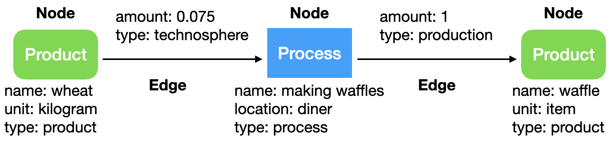
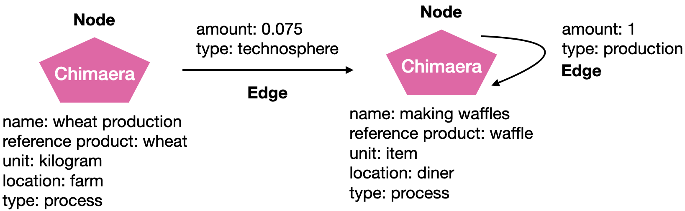

# Inventory data

## Processes, products, and something in between

At its heart, Brightway uses a graph data schema with nodes and edges. We are eventually moving towards storing everything in the graph, including databases and LCIA data, but for now our graph just has inventory data.

There are two main ways to model inventory data as nodes and edges. The ideal way would be to have a clean separation between products (goods and services) and processes. One way to think of this difference is that processes are verbs, doing activities in the economy, and products are nouns, concrete manifestations which can be measured. For example, a process could consume some raw materials and energy, and produce something useful and some waste. Each of these inputs and outputs are products.

It's important to bear in mind that both input and output edges can be functional. A functional edge is the purpose of modelling the process in the first place. Creating a process is a conscious decision, where a practitioner chooses that this process is a necessary and discrete part of a value chain, and is located in a particular spatial, temporal, and technological context. A waste treatment process can have a functional input edge, as this is the main function of that activity.

Here is an example of what such a graph would look like and the corresponding Brightway objects:



It's interesting to think about the implications of this paradigm. Processes separated from products do not have units, for example. Their input and output amounts are defined in proportion to their functional edges. Because processes can have more than one functional edge, they do not necessarily have a "reference product", so your code shouldn't assume this attribute is present.

When it comes to matrix construction, there is also no expectation of values being on the diagonal of the technosphere matrix, or any meaning to that diagonal - the ordering of processes and products is arbitrary and independent of one another. The only real constraint on processes and products is that the matrix produced from the entirety of the data is non-singular.

(chimaera)=

However, many databases we build on do not make a clean distinction between products and processes. In this case, to accurately reflect the data schema of the imported data, and to simplify graph traversal, we can create a chimaera node which is [both process and reference product](https://github.com/brightway-lca/bw_interface_schemas/blob/5fb1d40587aec2a4bb2248505550fc883a91c355/bw_interface_schemas/lci.py#L83). In this case, a process produces itself, as it is both a process and a product. Because the product and process are bound together, these processes can only have one functional edge. These chimaera nodes have the data of both the process and the product, and the information of the (reference) product is given in Brightway by:

* `unit`: The unit of the product produced
* `reference product`: The name of the product produced

Here is an example of what such this graph would look like:



The first approach is preferred in theory, and is what we encourage, but the second approach is more widely used in practice.

Either approach works with biosphere flow edges - they can be linked to both processes and and chimaera process+product nodes. However, biosphere flows *should not* be linked to separate products, as this makes no sense, and this information will be ignored in matrix construction.

## Data schema

### Processes

The data schema for process nodes is a dictionary. It has some required attributes:

    name: str
    unit: str
    location: str
    code: str
    database: str
    type: str = "process"
    exchanges: list[Edge] = []

And recommends the following attribute labels:

    created: datetime
    modified: datetime
    comment: Union[str, dict[str, str]]
    tags: dict[str, str]
    properties: dict[str, float]

These attributes are not exclusive - you can add any additional attributes you want to a process node.

* See [Matrix construction](./matrix.md) for how the `type` value is used.
* See [Creating initial project data](identifying-nodes) for an explanation of how to create and use the `code` value.
* `comment` can be a dictionary, like `{'main comment': 'text here', 'something else': 'hi mom!'}`.

Tags are used for discrete choices, usually from a pre-defined list of options. This can be used, for example, for classification systems. Properties are always numeric.

(identifying-nodes)=
### Uniquely identifying nodes

Linking nodes within and between databases requires a way to uniquely identify each node object. Brightway won't stop you from creating two nodes with the same attributes, so we can't count on any field or combination of fields to be unique. The field we use which is guaranteed to be unique is the database primary key integer `id`.

It can be convenient to have a field which summarizes the most important dataset attributes. For example, if you create a copy of a database, modify it, and the datasets in the copy share this same summary field, then it's very easy to compare the original LCA results versus the copy. That's what the `code` field is for. This is often made up by [hashing](http://en.wikipedia.org/wiki/MD5) the attributes of a node, but doesn't have to be. When you create datasets manually, you can assign each dataset a code. When you import a database, the codes will be automatically generated for you.

### Products

The data schema for product nodes is a dictionary. It has some required attributes:

    name: str
    unit: str
    location: Optional[str]
    code: str
    database: str
    type: str = "product"

And recommends the following attribute labels:

    created: datetime
    modified: datetime
    comment: Union[str, dict[str, str]]
    tags: dict[str, str]
    properties: dict[str, float]

These attributes are not exclusive - you can add any additional attributes you want to a product node.

```{warning}
You should not define edges on product nodes. Edges, both input and output, should only be defined on process and process+product nodes.
```

`location` is not needed on products which are the same globally, but sometimes products have properties which vary over time and space, in which case the `location` can be specified.

Tags and properties work the same way as they do for processes.

### Chimaera processes with reference products

[Chimaera processes](chimaera) act as both a process and a product at the same time.

The data schema for these nodes is a dictionary. It is the same as for processes, but also requires:

    reference product: str

And you can specify:

    production_amount: float

Note that the `production_amount` is not used in calculations, it is only for your convenience.
