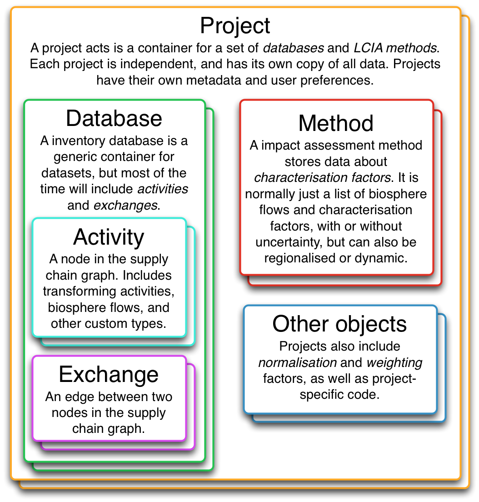

# Brightway Structure

## Brightway Objects

Data in Brightway is structured in a hierarchy. At the top level, we
have projects. A project is self-contained, with its own copy of data,
LCIA methods, calculations, assumptions, and any other data you need.
Each project is completely independent of other projects.Projects are
saved as subdirectories in the file system.

Inside a project we have a number of objects that store data. The most
common data objects are inventory *databases* and impact assessment
*methods*. However, non-LCA data can also be included. For example, a
set of vehicle registrations and lifetimes could also be stored in a
project, and used to generate fleet-based scenarios for sustainability
assessment of mobility services.

