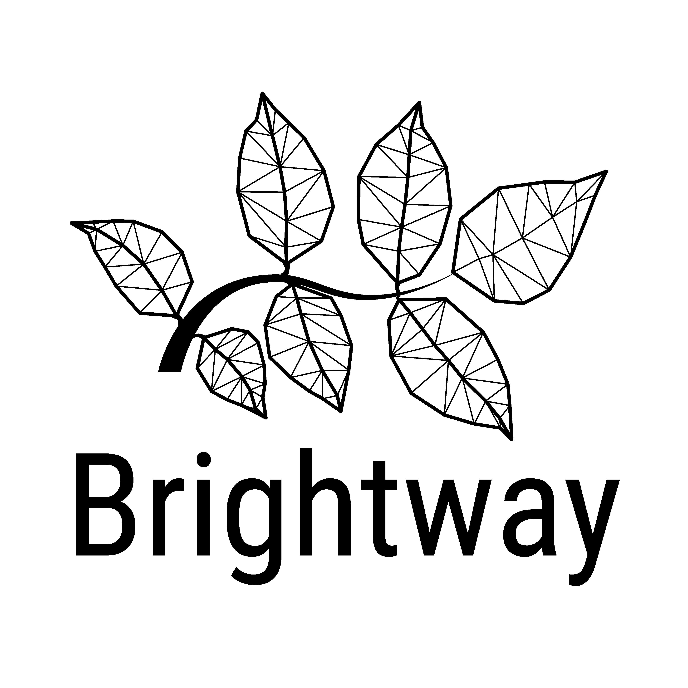

Brightway2 life cycle assessment framework
==========================================

.. image:: https://joss.theoj.org/papers/10.21105/joss.00236/status.svg
   :target: https://joss.theoj.org/papers/6c24869ed7f1e66b3b837c31579c6fe5
   :alt: Brightway publication in JOSS

Brightway2 is a open source framework for life cycle assessment (LCA). It is designed to be easy to use, while still being powerful. Brightway2 doesn't try to replace software like SimaPro or OpenLCA, but instead offers possibilities to those who need to go break the limits of conventional LCA. Brightway2 is especially attractive for researchers, especially when used with `Jupyter notebooks <http://jupyter.org/>`__. The core principles of Brightway2 are simplicity, innovation, and power.

Who is Brightway2 for?
----------------------

Brightway2 is for people who want more than is possible with current LCA or sustainability software. Researchers and academics are particularly suitable, because the power that Brightway2 brings is worth the cost of learning a new software and possibly a new language.

Brightway2 is not for people that want to do the same old LCA studies, just with a different software. If OpenLCA works for you now, stick with it. One particular weakness of Brightway2 is routine data entry, although there is an active project trying to make this better.

Basically, Brightway2 is for you if your project lies at the intersection of LCA and your imagination.

Understanding this documentation
--------------------------------

As this documentation covers a lot of material, it can be a bit overwhelming, especially at first. The manual is designed to help you get started in the following order:

* :ref:`Install Brightway <installation>` and set up a :ref:`notebook directory <notebook-directory>`.
* Read the :ref:`introduction to brightway2 concepts <intro>`.
* Look at some of the :ref:`example notebooks <example-notebooks>`.
* Use the rest of the documentation as a reference while creating next-generation LCA studies. If you need additional help, you can search the documentation (search box is on the left), or look in the :ref:`genindex`.

Other resources
---------------

* Ask `Brightway2 questions on Stack Overflow <http://stackoverflow.com/questions/tagged/brightway?sort=newest>`__ (note: tag is `brightway`).
* `Brightway2 development blog <http://chris.mutel.org/>`__

Citing brightways
===================

Many of the contributors to brightways work in institutions where
citation metrics are used in performance or career evaluations. If you
use brightways in a published work, please cite:

  Mutel, (2017), Brightway: An open source framework for Life Cycle 
  Assessment, Journal of Open Source Software, 2(12), 236, 
  doi:10.21105/joss.00236

Please also cite the DOI corresponding to the specific version of
brightways that you used. 

Contents
========

.. toctree::
   :maxdepth: 1

   source/user_guide/index
   source/gallery/index
   source/api/index
   source/changelog/index
   source/faq

Indices and tables
==================

* :ref:`genindex`
* :ref:`search`